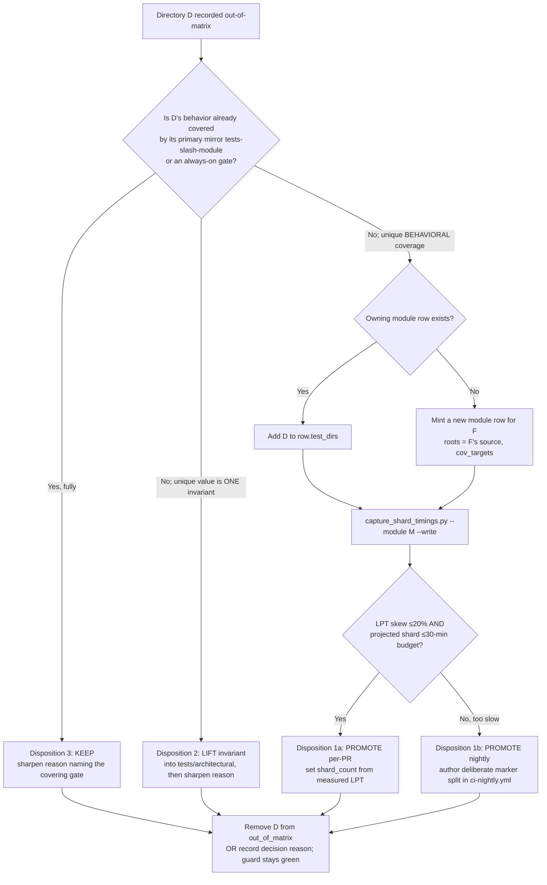

# Implementation Plan: Decide the fate of out-of-matrix test directories

**Branch**: `chore/decide-out-of-matrix-test-dirs` | **Date**: 2026-09-18 | **Spec**: [spec.md](./spec.md)
**Input**: Feature specification from `kitty-specs/decide-out-of-matrix-test-dirs-01M2TKC7/spec.md`
**Issue**: spec-kitty/spec-kitty#4374 (P3 `type:chore`, milestone 4.0.0)

## Summary

Convert every targeted `out_of_matrix_test_dirs` entry in `.github/ci-module-registry.yml` into a deliberate
decision: **promote** the tree into a module row's `test_dirs` (evidence-backed), **lift** a unique repo-invariant
into the always-on `tests/architectural` battery (the #4715 pattern), or **keep** it out-of-matrix with a
sharpened reason naming the gate that already covers it. Two populations, both in scope: (a) 60 secondary
`tests/specify_cli/**` trees (447 direct test files), (b) 68 no-per-PR-lane dirs (525 direct test files).
The mechanism is fixed by the existing registry/guard/timings machinery — this mission does **not** invent new
sizing logic; it applies the existing one (`capture_shard_timings.py` → measured durations → offline greedy-LPT
`shard_count` → guard-enforced ≤20% skew) and records a decision per entry.

## Technical Context

**Language/Version**: Python 3.11+ (repo standard; CI also runs a nightly 3.13 interpreter matrix)
**Primary Dependencies**: pytest (+pytest-xdist), PyYAML (registry I/O), GitHub Actions (reusable-workflow matrix); no new runtime dependency is added by this mission
**Storage**: Version-controlled config files — `.github/ci-module-registry.yml` (registry SSOT), `.github/ci-shard-timings.json` (measured durations), `tests/architectural/` (always-on guards)
**Testing**: pytest; the binding gates are `tests/architectural/test_module_shard_registry.py` (claim/record-once, skew, real-dir/real-reason, non-nesting) and, for lifted invariants, new/existing `tests/architectural/` tests
**Target Platform**: CI (GitHub Actions, `ubuntu-latest`; `ci-windows.yml` on `windows-latest` for the `windows_ci` marker) + local `make test-fast`/`make test-full`
**Project Type**: single repo — CI-infrastructure / test-governance change (config + architectural tests), no product source behavior change
**Performance Goals**: each promoted module's per-PR shard stays within the 30-minute design budget (CI hard ceiling `timeout-minutes: 40`, #4429); measured-run capture cost is bounded by re-measuring only modules that are actually expanded
**Constraints**: `shard_count` never guessed / never from file counts — greedy-LPT over measured per-test `call`-phase durations, within-module inter-shard skew ≤ 20% (registry NFR-005); every promotion references a fresh `run_id` in `ci-shard-timings.json`; positional pairing requires `len(module_test_durations[m]) == collected test count` for the expanded module; `test_dirs` entries must be real, pairwise non-nested directories; no test-content edits; PO owns versioning
**Scale/Scope**: 128 targeted directories (60 + 68), ~972 direct test files, plus recursive subtrees; excludes `tests/specify_cli/cli/commands` (#4715) and the 5 already-decided named-home entries (`tests`, `tests/docs`, `tests/e2e`, `tests/architectural`, `tests/ui`)

### Canonical surfaces (authoritative, do not improvise substitutes)

| Surface | Path | Role |
|---------|------|------|
| Registry (SSOT) | `.github/ci-module-registry.yml` | module rows + `out_of_matrix_test_dirs` |
| Timing evidence | `.github/ci-shard-timings.json` | `module_test_durations{module→[float]}`, `run_id` |
| Measured-run producer | `scripts/ci/capture_shard_timings.py` | `--module <m> --write` (serial, consumer selection) |
| Claim/record guard | `tests/architectural/test_module_shard_registry.py` | claim-once, skew≤20%, real-dir/reason, non-nesting |
| Invariant-lift pattern | `tests/architectural/test_completion_manifest_freshness.py` | #4715/#4479 precedent |
| Matrix consumer | `.github/workflows/ci-modules.yml` → `module-tests.yml` | per-PR shard execution |
| Diff→module map | `scripts/ci/gate_selection.py` | selects modules incl. tests-only diffs within `test_dirs` |
| Marker lanes | `ci-router.yml` (corpus), `ci-windows.yml` (windows_ci), `ci-nightly.yml` (perf/e2e/interpreter) | population-(b) marker homes |

## Constitution / Charter Check

*GATE: Must pass before Phase 0 research. Re-check after Phase 1 design.*

Charter present at `.kittify/charter/charter.md`. Relevant standing orders and directives, and how this plan satisfies them:

- **Canonical sources, never improvise (CLAUDE.md; C-005)** — PASS. The plan reuses `capture_shard_timings.py`, the registry, and the guard's own LPT/skew rules; it introduces no parallel sizing mechanism.
- **DIRECTIVE_024 Locality of change / DIRECTIVE_025 Boy-Scout** — PASS. Edits are confined to the registry, the timings file, and `tests/architectural/`. In-tree test reds are explicitly out of scope (routed as honest-red per the Pre-existing Failure Reporting Rule).
- **Honest-red / Pre-existing Failure Reporting Rule** — PASS. A real red found while measuring is filed as its own ticket, never green-washed; measured-run capture explicitly classifies pre-existing vs. introduced (baseline-red gotcha).
- **DIRECTIVE_010 Specification fidelity** — PASS. Every disposition traces to an FR/NFR/SC; acceptance is guard-green + zero snapshot reasons.
- **Terminology Canon (Mission vs Feature)** — PASS. No `feature*` identifiers introduced; module names are pre-existing registry terms.
- **Testing policy (CLAUDE.md blast radius)** — the mission's own blast radius is `tests/architectural/` (cross-cutting: it edits registry + timings + guards). Every promotion also runs the expanded module's own tests locally.
- **No version prescription (C-004)** — PASS. No release/version number assigned.

No charter conflict identified. No new dependency → the Supply-Chain Install-Safety directive (DIRECTIVE_051) is **not triggered** (recorded in research.md).

## Project Structure

### Documentation (this mission)

```
kitty-specs/decide-out-of-matrix-test-dirs-01M2TKC7/
├── plan.md              # This file
├── research.md          # Phase 0: mechanism findings + decisions
├── data-model.md        # Phase 1: entities (entry, row, disposition, evidence)
├── quickstart.md        # Phase 1: how to measure, promote, and verify one tree
├── contracts/
│   ├── disposition-decision-procedure.md   # the per-tree decision contract
│   └── acceptance-checks.md                 # guard/evidence checks the mission must pass
└── tasks.md             # Phase 2 (/spec-kitty.tasks — NOT created here)
```

### Touched source (repository root)

```
.github/
├── ci-module-registry.yml        # promote → row.test_dirs; sharpen → out_of_matrix reasons; new rows (pop-b)
├── ci-shard-timings.json         # fresh run_id + module_test_durations for every expanded module
└── workflows/                    # only if a nightly marker split is authored (too-slow promotion)
    └── ci-nightly.yml            # deliberate marker split (in-scope per discovery)
tests/
└── architectural/                # lifted invariants (#4715 pattern) + guard stays green
scripts/ci/
└── capture_shard_timings.py      # invoked (not edited) to produce measured runs
```

## The per-tree decision procedure (core of the mission)

For each targeted directory `D` (owning family `F`):



**Evidence rule (binding):** disposition 1 (either variant) never lands without a fresh `run_id` in
`ci-shard-timings.json` covering the expanded module, with positional pairing intact. Dispositions 2 and 3
need no measurement.

**Default bias:** most secondary `specify_cli` trees whose behavior is a strict subset of their primary mirror
resolve to disposition 3 with a sharpened reason; promotion is reserved for trees with demonstrable unique
behavioral coverage. This keeps the per-PR matrix lean while eliminating snapshots.

## Sequencing (security/regression-relevant first)

1. **Phase S — security/regression-relevant**: `tests/auth/**` (pop-b, 5 dirs/40 files), `tests/specify_cli/status` + `tests/cross_cutting/dashboard` + `tests/specify_cli/dashboard` (dashboard-adjacent), `tests/specify_cli/merge`, `tests/specify_cli/status`.
2. **Phase A — remaining population (a)** secondary `specify_cli` trees, grouped by owning module.
3. **Phase B — remaining population (b)** families (integration, tracker, contract, cross_cutting, git_ops, dossier, …) + the long singleton tail.
4. **Phase V — verification & closeout**: guard green, evidence complete, injected-red proof (SC-005), snapshot count zero.

## Risks & mitigations

| Risk | Mitigation |
|------|------------|
| Measured-run capture is expensive for large modules (e.g. `cli` 2704 tests) | Re-measure only modules actually expanded; batch a family's dirs into one row + one capture; most trees resolve to disposition 3 (no measurement) |
| Positional-pairing drift (`len(durations)!=collected`) silently falls back to uniform weights | Capture with the exact consumer selection; assert count parity after `--write`; verify skew guard exercises the row |
| Promotion trips the "claimed AND recorded" red | Remove D from `out_of_matrix` in the same edit that adds it to `test_dirs` |
| Non-nesting guard (a new `test_dirs` entry contains/!nested another claim) | Check pairwise non-nesting before landing; prefer leaf dirs |
| Population-(b) family has no clean source root for a new row | Fall back to disposition 3 with a marker/nightly reason, or fold into an existing aggregate (core_misc precedent) — decided per family with rationale |
| A real red surfaces during measurement | Classify (baseline-red gotcha), file its own ticket, keep the disposition decision moving (honest-red) |
| 30-min design budget vs 40-min CI ceiling confusion | Size to the 30-min budget; treat 40-min as the hard failure ceiling, not the target |
| CI is fork-safe / secrets-gated | Land config + guard changes; rely on the always-on architectural battery + local capture for proof, not on a full CI matrix run this mission cannot trigger |

## Phase 0: Outline & Research → `research.md`

Resolve: (1) the exact guard contract and companion guards; (2) the measured-run procedure and timings schema;
(3) the LPT/skew/timeout enforcement; (4) the matrix-consumer wiring; (5) the promotion precedents; (6) the
#4715 invariant-lift pattern; (7) the marker-lane homes for population (b). All resolved (see research.md).
Supply-chain posture: no dependency change → DIRECTIVE_051 not triggered (documented, not silently skipped).

## Phase 1: Design & Contracts → `data-model.md`, `contracts/`, `quickstart.md`

- `data-model.md`: entities — Out-of-matrix entry, Module row, Measured timing record, Disposition, Registry guard, Population; their fields, invariants, and state transitions (recorded → decided).
- `contracts/disposition-decision-procedure.md`: the binding per-tree procedure + evidence rule.
- `contracts/acceptance-checks.md`: the exact commands/gates that must pass (guard green, run_id freshness, injected-red proof).
- `quickstart.md`: end-to-end worked example promoting one tree and sharpening one reason.

## ⛔ STOP after Phase 1

`/spec-kitty.tasks` translates this plan's decision procedure and phasing into executable work packages.

---

## Post-plan squad amendments (AUTHORITATIVE — supersede the procedure/risks above)

The post-plan brownfield squad (paula-patterns, reviewer-renata, planner-priti) surfaced architectural
constraints that reshape the mission. The binding procedure is now
[`contracts/disposition-decision-procedure.md` (v2)](./contracts/disposition-decision-procedure.md) and
[`contracts/acceptance-checks.md` (v2)](./contracts/acceptance-checks.md). Summary of what changed:

1. **Minting a new module row is a census-gated TWO-FILE edit** (scrub-bijection guard,
   `test_module_shard_registry.py:149-189`): `tests/release/ci_retirement_scrub.json` group first, then a
   verbatim `roots`/`cov_targets` registry row. Registry is NOT the sole SSOT of module identity — the scrub is.
   Added to canonical surfaces.
2. **Aggregate-fold is prohibited as a promotion** (selection is `roots`-based via `gate_selection.py`, not
   `test_dirs`-based) — folding `tests/auth` into `core_misc.test_dirs` would NOT run on a `src/…/auth` diff.
3. **Nested-family pre-check (PC1)**: `tests/specify_cli/cli` and similar parents that contain the #4715
   exclusion or a foreign claim are promotion-blocked; legal promotion is parent-only + atomic descendant
   de-record.
4. **Ownership tie-break (PC2)** for shared-root trees (e.g. `tests/specify_cli/status`, root in 4 rows) → the
   leaf-specific row, never an aggregate.
5. **special_tiers.integration_tests_next (PC3)** is a third claim-surface (roots `tests/integration/**` +
   `tests/next/**`, ~69 min, job currently UNWIRED). Integration/next get a dedicated too-slow phase and must
   reconcile with this tier, not mint fresh rows.
6. **Disposition-3 must PROVE coverage-equivalence** (coverage-diff JSON) and name an in-matrix target; the
   "primary mirror" direction is resolved by superset, not by the lossy leaf-transform.
7. **Pop-(b) disposition-3 must verify marker presence** (grep) before naming a marker home (#2979 class).
8. **Evidence is runnable**: freshness + positional parity gated via `module_capture_provenance`.
9. **SC-005 injected-red goes through `gate_selection.py` with SOURCE injection**, proving real per-PR selection.
10. **Hard promotion cap** (priti F6): default bias to dispositions 2/3 is a *sizing guardrail*. Promote only a
    small N into existing rows + at most the security-critical new row(s) this PR; defer the rest as recorded
    decisions to a follow-up. Worst-case unbounded promotion (15–40 serial captures) must not balloon one PR.

### Canonical surfaces (amended)
Add: `tests/release/ci_retirement_scrub.json` (census-gated module-identity SSOT; new rows require a group here
first) and `.github/ci-module-registry.yml` `special_tiers` (integration/next claim-surface).

### Issue linkage
- **Fold #4426 (P1)**: its acute red is resolved on this branch; its two dirs (`tests/performance`,
  `tests/specify_cli/live_work`) are decided here → close #4426 on merge.
- **Link #4708 (epic, P2)** and **#2979 (P2)** as related (honest-execution parent + marker-invisibility class).

### Reshaped phasing
- **Phase S** (security-first): auth (new-row-via-scrub or honest disposition-3 with marker/nightly), status,
  dashboard, merge — capped promotions.
- **Phase A**: pop-(a) trees with an existing owning row + PC1 clean → verified promote or verified sharpen.
- **Phase I** (NEW, isolated): `tests/integration/**` + `tests/next` — reconcile with `integration_tests_next`
  (too-slow/nightly); its unwired job flagged.
- **Phase B**: remaining pop-(b) families → verified sharpen (marker-checked) or deferred-promotion decisions.
- **Phase V**: guard green, evidence complete, injected-red proof, snapshot count zero, #4426 closed.
